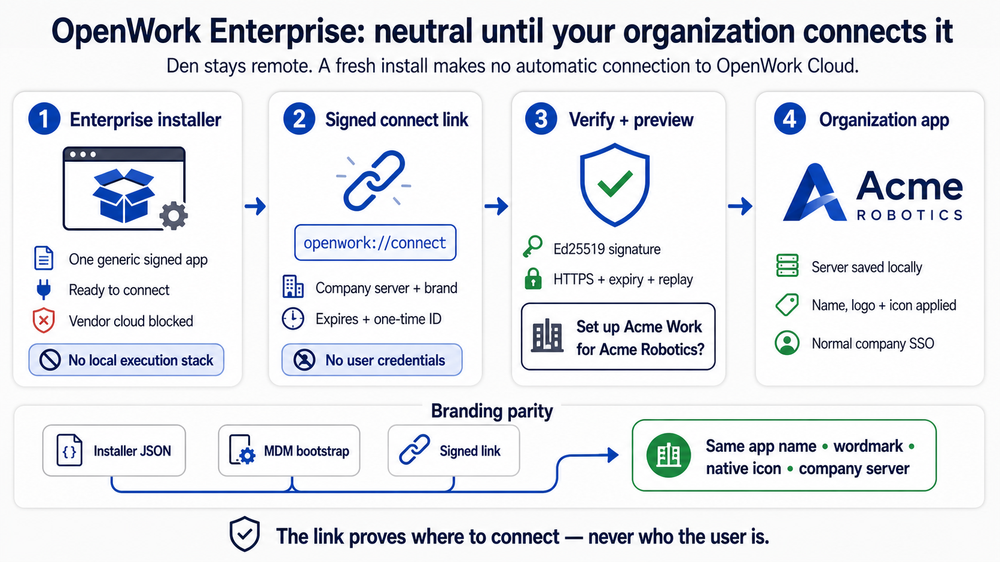
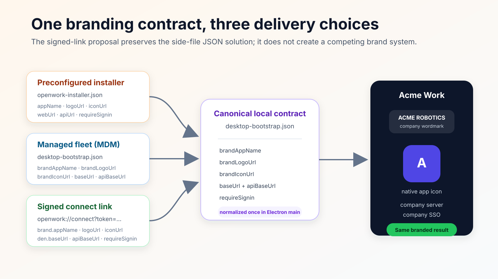

# OpenWork Enterprise Installer and Signed Connect Links

Status: proposal / dark-launch implementation
Owner: platform/self-host
Related: `ee/apps/den-api/src/routes/org/connect-links.ts`, `packages/connect-link/`,
`apps/desktop/electron/connect-link.mjs`, `apps/desktop/electron-builder.enterprise.yml`,
`docs/org-install-links.md`

## What it is

Two pieces give enterprises a neutral desktop that belongs to their
organization before it belongs to any cloud:

1. **OpenWork Enterprise** — an installer flavor that makes no automatic
   connection to OpenWork Cloud. It waits for an organization configuration
   delivered by managed JSON, manual server entry, or a confirmed signed link.
   Because its execution lives on organization infrastructure, the artifact
   also ships no local execution
   stack: no in-process `openwork-server`, no OpenCode or orchestrator sidecar
   binaries, no computer-use helper (662 MB → 296 MB in the final macOS arm64
   directory-build comparison). A fresh
   install boots to a neutral "Ready to connect" screen instead of starting
   anything locally.
2. **Connect links** — `openwork://connect?token=<JWT>`, a signed, emailable
   deep link that points the app at an organization's deployment. The app
   verifies the token offline against Ed25519 public keys embedded in the
   build, shows the user exactly what will change, and only persists the
   configuration after an explicit confirmation.

A connect link is **configuration provenance, not authentication**. Clicking
it never signs anyone in; it tells the app where the organization's control
plane lives. Access still requires signing in against that deployment
(password, OTP, SSO — whatever the org enforces).

**Den is remote infrastructure. It is not bundled in either desktop flavor.**
The standard desktop can start a local OpenWork server and agent sidecars; the
enterprise artifact omits that local execution stack because it is designed to
connect to an organization-managed deployment. The proposal's defining
property is network neutrality before configuration, not “removing Den.”



## Why a new convention

Today the desktop learns its control plane from `desktop-bootstrap.json`,
delivered by one of three legacy transports:

| Transport | Mechanism | Gap |
|---|---|---|
| Org install links (`docs/org-install-links.md`) | Den stamps the config into the installer artifact at serve time | Per-org download and distribution workflow |
| MDM-managed file | IT writes `desktop-bootstrap.json` to a canonical path | Excellent for managed fleets, but needs device management |
| Bootstrap CLI / handoff | `openwork-bootstrap` writes the file + one-time auth grant | Developer tooling, not an end-user flow |

Neither JSON file is being replaced. The installer side file remains the
deterministic air-gapped/preconfigured workflow, while the canonical bootstrap
remains the best direct transport for MDM. Connect links improve delivery for BYOD and
non-MDM fleets: **one generic enterprise artifact** plus **a user-clickable,
verifiable config transport**. Existing deep links
(`openwork://den-auth?grant=…`) carry loose query parameters; anything that
*configures* the app should instead carry one signed envelope whose origin the
app can prove. That is the new convention connect links set.

## How this improves on the side-file JSON solution

The deterministic organization installer reads `openwork-installer.json`, and
MDM can write `desktop-bootstrap.json` directly. Signed links preserve both
paths' branding choices. All three converge on the canonical bootstrap schema:

| Organization choice | Installer side file | Canonical bootstrap | Signed-link field |
|---|---|---|---|
| Application name | `appName` | `brandAppName` | `brand.appName` |
| Wordmark / in-app logo | `logoUrl` | `brandLogoUrl` | `brand.logoUrl` |
| Native app / taskbar icon | `iconUrl` | `brandIconUrl` | `brand.iconUrl` |
| Web and API targets | `webUrl`, `apiUrl` | `baseUrl`, `apiBaseUrl` | `den.baseUrl`, `den.apiBaseUrl` |
| Sign-in requirement | `requireSignin` | `requireSignin` | `requireSignin` |

The difference is transport and trust:

| Side-file JSON | Signed connect link |
|---|---|
| IT or a branded installer places a trusted file before launch | An admin can email a generic installed app a signed configuration envelope |
| Ideal for MDM, offline, and centrally managed devices | Ideal for BYOD, contractors, pilots, and server migrations |
| Trust comes from the managed file-delivery channel | Trust comes from Ed25519 verification against embedded public keys |
| Applies on startup | Shows organization, branded app name, and server before an explicit confirmation |
| Long-lived until replaced | Expires and is one-time-use per machine |

After confirmation, the main process maps the verified brand and target fields
through the existing bootstrap normalizer. The renderer never invents a second
branding system.



## Architecture

```
  Org admin                    Den (org's deployment            Vendor secret store
     |                         or OpenWork Cloud)               (Infisical/Render/Helm)
     |  POST /v1/orgs/:id/connect-links   |                            |
     +--------------------------------->  |   DEN_CONNECT_LINK_PRIVATE_KEY
     |                                    +<---------------------------+
     |                                    |  sign EdDSA JWT (kid)
     |                                    |  build openwork://connect?token=…
     |                                    |  email "Connect your desktop"
     |                                    +------------------+
     |                                                       v
     |                                              Teammate's inbox
     |                                                       |
     |                                                       | click / paste
     |                                                       v
     |                                      OpenWork Enterprise (Electron)
     |                                        +--------------------------+
     |                                        | renderer: relay raw URL  |
     |                                        |   (never interprets it)  |
     |                                        | main: verify signature   |
     |                                        |   against EMBEDDED keys  |
     |                                        |   exp/aud/v/https/jti    |
     |                                        | user: explicit confirm   |
     |                                        | main: write bootstrap    |
     |                                        +--------------------------+
     |                                                       |
     |                                                       v
     |                                         desktop-bootstrap.json
     |                                         { baseUrl, apiBaseUrl,
     |                                           requireSignin: true,
     |                                           brandAppName/LogoUrl,
     |                                           brandIconUrl }
     |                                                       |
     |                                                       v
     |                                          forced sign-in (SSO/OTP)
     +------------------------------------------------------ +
```

## Sequence

```
 Admin          Den API           Email         Client app (renderer)   Client app (main)
   |  mint         |                |                    |                    |
   |-------------->| sign(JWT,kid)  |                    |                    |
   |               |--------------->| connect email      |                    |
   |               |                |------------------->| click deep link    |
   |               |                |                    |-- raw URL -------->|
   |               |                |                    |                    | verify sig (embedded key)
   |               |                |                    |                    | check exp/aud/v/https/jti
   |               |                |                    |<-- claims ---------|
   |               |                |                    | show org + host    |
   |               |                |                    | user confirms      |
   |               |                |                    |-- raw URL -------->|
   |               |                |                    |                    | RE-verify + jti dedupe
   |               |                |                    |                    | write desktop-bootstrap.json
   |               |                |                    |<-- ok, config -----|
   |               |                |                    | forced sign-in     |
```

The accept call re-verifies the raw URL inside the main process; claims shaped
in the renderer are never trusted (see the trust-boundary note in
`packages/types/src/desktop-ipc.ts`).

## Token format

Compact JWS, EdDSA/Ed25519, signed with a **dedicated** keypair — deliberately
not the Better Auth session JWKS, whose 24-hour rotation would invalidate
emailed links and whose audience is session auth.

```
header : { "alg": "EdDSA", "typ": "JWT", "kid": "owc-2026-07" }
payload: {
  "iss": "https://api.openwork.acme.example.com",
  "aud": "openwork-desktop-connect",
  "iat": 1783000000,
  "exp": 1783259200,
  "jti": "8mP0…",
  "v": 1,
  "org": { "name": "Acme Robotics" },
  "brand": {
    "appName": "Acme Work",
    "logoUrl": "https://openwork.acme.example.com/wordmark.svg",
    "iconUrl": "https://openwork.acme.example.com/icon.png"
  },
  "den": { "baseUrl": "https://openwork.acme.example.com",
           "apiBaseUrl": "https://api.openwork.acme.example.com" },
  "requireSignin": true
}
```

| Claim | Purpose |
|---|---|
| `iss` | Minting deployment's public API origin (informational in v1) |
| `aud` | Fixed `openwork-desktop-connect`; rejects tokens minted for any other purpose |
| `iat` / `exp` | Validity window; default 72 h, max 168 h, 60 s clock skew |
| `jti` | One-time-use id; the app refuses a second acceptance on the same machine |
| `v` | Payload schema version (currently `1`) |
| `org` | Display-only: what the confirmation dialog shows |
| `brand` | Organization-managed app name, wordmark, and native icon; maps to the existing bootstrap JSON fields |
| `den` | The control-plane target written to `desktop-bootstrap.json` |
| `requireSignin` | Always `true` for organization-managed installs |

Schema + signer: `packages/connect-link` (`connectLinkClaimsSchema`,
`signConnectLinkToken`). Desktop verifier: `apps/desktop/electron/connect-link.mjs`
(dependency-free mirror, held to the package implementation by tests).

## Key management

- Generate: `node scripts/generate-connect-link-keypair.mjs [kid]`.
- The **private key** lives only in the minting deployment's secret store:
  env `DEN_CONNECT_LINK_PRIVATE_KEY` + `DEN_CONNECT_LINK_KEY_ID` (Infisical /
  Render dashboard / Helm `secret.values.connectLinkPrivateKey`). It is never
  committed; den-api returns `503 connect_links_not_configured` until set.
- The **public keys** ship in the app:
  `apps/desktop/electron/connect-link-keys.mjs`, a `kid → PEM` map. Public
  keys are safe to publish — possession only lets you *verify* links, not mint
  them.
- Rotation: add the new public key beside the old (`owc-<yyyy-mm>` naming),
  release the app, flip the minting env to the new kid after an adoption
  window, drop the old entry in a later release. Unknown `kid` → the app says
  "update the app".
- The committed `owc-dev-2026-07` key is an evaluation key for demos and
  evals while the feature is dark; the vendor mints a production keypair
  before enabling connect links for real organizations.
- Dev/evals only: with `OPENWORK_DEV_MODE=1`, one extra test key can be
  injected via `OPENWORK_CONNECT_TEST_PUBLIC_KEY_PEM/_KID`. Packaged
  production builds ignore these variables.

## Threat model

No security mechanism is "foolproof"; this table states each considered
threat and the specific control that answers it.

| Threat | Control |
|---|---|
| Tampered payload (point the app at an attacker server) | EdDSA signature over the whole payload; verification against embedded keys happens in the Electron main process |
| Forged token (attacker mints their own) | Only holders of the vendor-held private key can sign; HMAC was rejected because client-side verification would require shipping the secret |
| Algorithm confusion / `crit` smuggling | Verifier accepts exactly `alg: EdDSA`, rejects `crit`, requires a known `kid` |
| Replay of a leaked link | Short `exp` (≤ 168 h) + one-time `jti` per machine (`connect-link-seen.json`) |
| Silent reconfiguration | Nothing is written without the confirmation dialog showing org + target host; switching deployments shows a from → to variant |
| Downgrade to plaintext | `https` required for every URL claim; `http` allowed only for loopback in dev mode |
| Fresh enterprise install contacts OpenWork Cloud | Electron blocks `openworklabs.com` requests until managed JSON, manual entry, or confirmed link supplies a configuration |
| Email forwarding / leaked link | The link only configures; access still requires signing in to the org's deployment. Worst case matches the documented install-link posture: org name + server URLs disclosed |
| Rogue app registered on `openwork://` | The OS may hand the link to another handler, but the payload contains no credentials — a rogue app learns the org name and server URLs only |
| Key compromise | Rotation story above; keys are purpose-bound (`aud`) so a stolen connect key cannot mint session tokens |
| Malicious Den response after connect | Out of scope here: identical to any deployment the user signs into; standard TLS + auth apply |

Known residual limits, stated plainly: the `jti` seen-set is per machine (a
forwarded link can configure a *different* machine within its validity
window — by design, since that is exactly the invite use case); `iss` is not
yet pinned to `den.apiBaseUrl` (warn-only candidate for v2); tokens ride OS
deep-link plumbing, which other local apps can observe on some platforms.

## Enterprise installer flavor

| Aspect | Standard | OpenWork Enterprise |
|---|---|---|
| appId / product | `com.differentai.openwork` / OpenWork | `com.differentai.openwork.enterprise` / OpenWork Enterprise |
| Before configuration | Uses normal local/cloud-ready defaults | Makes no automatic OpenWork Cloud connection; waits at “Ready to connect” |
| Den | Remote; never bundled | Remote; never bundled |
| Local stack | in-process server + OpenCode + orchestrator + helper | none (runtime IPC guarded, boot skips engine paths) |
| Artifact | `openwork-<os>-<arch>-<v>` | `openwork-enterprise-<os>-<arch>-<v>` (~55% smaller on macOS) |
| Updater feed | `latest*.yml` | `enterprise*.yml` on the same release (fleet can never be auto-updated into the bundled build) |
| First run | local workspace | "Ready to connect" gate until configured |
| Build | `package:electron` | `package:electron:enterprise` (`--enterprise` + `electron-builder.enterprise.yml`, `extraMetadata.openworkEnterprise`) |

Both flavors register the `openwork://` scheme and both accept connect links
(a standard install can also be pointed at an org); only the enterprise flavor
starts network-neutral behind the "Ready to connect" gate.

## Migration and coexistence

- **Org install links stay.** They remain the right tool for "download an
  installer that is already yours". Connect links become the recommended
  pairing path once an app is installed — MDM fleets, BYOD, re-pointing after
  a migration, or the enterprise flavor.
- **MDM-managed `desktop-bootstrap.json` stays** fully supported and is the
  offline/air-gapped alternative; connect links write the same file through
  the same normalization.
- **`openwork://den-auth` handoff stays** — it is authentication, not
  configuration; the two compose (connect first, then sign in).

## Operator guide (self-hosted Den)

1. Generate a keypair: `node scripts/generate-connect-link-keypair.mjs`.
2. Set `DEN_CONNECT_LINK_PRIVATE_KEY` + `DEN_CONNECT_LINK_KEY_ID` on den-api
   (Helm: `secret.values.connectLinkPrivateKey` +
   `config.public.connectLinkKeyId`).
3. Hosted deployments with per-org rollout: enable the `connectLinks`
   capability from `/admin` (gate `DEN_CONNECT_LINKS_GATING_ENABLED`, default
   follows plan gating like install links). Self-hosted deployments skip this.
4. Mint: `POST /v1/orgs/:organizationId/connect-links`
   `{ "email": "teammate@acme.example.com", "ttlHours": 72 }` (owner/admin,
   rate-limited, emails via the deployment's provider; `send: false` returns
   the link for Slack/manual delivery).
5. Note: verification keys ship with the app, so self-hosted keys must be in
   the app's embedded key map. Until pluggable trust lands (open question
   below), vendor-operated deployments are the practical minting surface.

## Open questions

- Per-customer kids vs one vendor kid (blast-radius isolation vs simplicity).
- Pluggable trust for forks/self-hosters: let an enterprise pin its own
  public key at install time (MDM-managed key file) so its own Den can mint
  without vendor involvement.
- Pinned-domain JWKS refresh so key rotation stops requiring an app release.
- Revocation beyond expiry (deny-list endpoint or short-lived links only).
- Windows/Linux enterprise artifact rollout cadence; den-web admin UI beyond the
  minimal mint endpoint.
