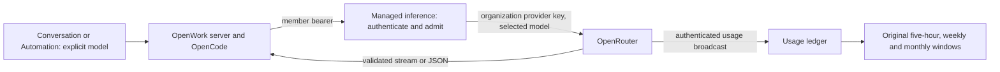

# OpenWork managed inference

OpenWork Models routes chat requests through OpenRouter using an organization-owned
provider key. This service does not train models or host their weights. Each active
member receives an `ow_inf_` bearer key; the inference service resolves that member's
organization, verifies access and allowance, and decrypts only that organization's
provider key. Clients never receive the upstream key.

The free starter model, `opencode/big-pickle`, uses OpenCode Zen and its provider-owned
free allowance. It does not consume the managed organization's three allowance
windows. Personal provider connections and organization-assigned custom providers
use their own credentials and `lpr_*` identities. They are not interchangeable with
OpenWork Models. [OpenCode Zen](https://opencode.ai/docs/zen) describes the separate
free offering; its continued availability is controlled by that provider.

## One model contract

`packages/types/src/den/inference.ts` owns the offered aliases and unchanged usage
factors. `inference-capabilities.json` records provider facts and their observation
time. The inference API, generated public model catalog, Den model lookup, Desktop
provider materialization, cloud execution configuration, reasoning selector, model
picker and Automation selection consume these shared definitions.

The currently offered IDs were verified against the unauthenticated
[OpenRouter model API](https://openrouter.ai/docs/api/api-reference/models/get-models).
This is live catalog verification, not a generation test or an availability promise.
The snapshot uses the smaller of the model and top-provider context limits, and caps
output at the reported completion limit. All nine expose text output and tool support.

| Public name | Alias and upstream ID | Supported input | Context / maximum output tokens | Reasoning controls |
| --- | --- | --- | --- | --- |
| GLM-5.2 | `z-ai/glm-5.2` | Text | 1,048,576 / 131,072 | High, xhigh |
| Kimi K2.7 Code | `moonshotai/kimi-k2.7-code` | Text, images | 262,144 / 235,929 | Required; default controls |
| Hy3 preview | `tencent/hy3-preview` | Text | 262,144 / 235,929 | None, low, high |
| Kimi K2.6 | `moonshotai/kimi-k2.6` | Text, images | 262,144 / 235,929 | Default controls |
| DeepSeek V4 Flash | `deepseek/deepseek-v4-flash` | Text | 1,024,000 / 384,000 | High, xhigh |
| MiniMax M2.7 | `minimax/minimax-m2.7` | Text | 204,800 / 131,072 | Required; default controls |
| MiniMax-M3 | `minimax/minimax-m3` | Text, images | 524,288 / 512,000 | Default controls |
| GLM-5.1 | `z-ai/glm-5.1` | Text | 200,000 / 128,000 | Default controls |
| Kimi K3 | `moonshotai/kimi-k3` | Text, images | 1,048,576 / 943,718 | Low, high, max |

Refresh facts with `node ee/apps/inference/scripts/update-capabilities.mjs`, review
the diff, then rebuild the model site. A missing upstream model stops the refresh
instead of silently changing the offered set. Additions, retirement and usage-factor
changes require explicit policy edits. Runtime discovery also checks entitlement,
complete allowance policies and an active organization provider key; unavailable
access returns an empty usable-model list with an error category.

The model picker explains text/image support and maximum context/output capacity.
These are protocol capabilities, not evidence of reliable performance on browser or
native-computer tasks. Raw PDFs use the existing attachment preparation path. Video,
audio generation and realtime audio are not advertised by this chat contract.
Voice has a separate OpenAI realtime/transcription implementation and accounting
path; its feature behavior is outside this change.

## Request, stream and recovery behavior

Only authenticated model discovery and Chat Completions are supported. The service
accepts the existing optional `openwork/` alias prefix and preserves model IDs.
It rejects alternate-model selectors, server tools, incompatible message parts,
unmatched tool results, invalid function schemas, output limits and unsupported
reasoning controls before generation. It preserves reasoning blocks and complete
assistant/tool history, following the provider's
[tool-calling](https://openrouter.ai/docs/guides/features/tool-calling) and
[reasoning](https://openrouter.ai/docs/guides/best-practices/reasoning-tokens) contracts.
Reasoning consumes the total output budget. Mandatory reasoning and per-model
effort selectors come from discovery, rather than inferred model names.

OpenRouter normally supports provider fallbacks and can ignore unsupported
parameters. Managed requests explicitly require parameter support and disable
provider fallback. They never supply another model, credential or account on
failure. OpenRouter still selects an initial serving provider for the chosen model;
this does not pin a particular GPU host. See
[provider selection](https://openrouter.ai/docs/guides/routing/provider-selection).
The gateway makes one generation attempt, preserves valid `Retry-After`, and does
not replay a request or tool call. Engine/client retry policy remains separate.

Implicit context trimming is disabled. The gateway validates requested output
limits but does not estimate multimodal input tokens with an approximate tokenizer.
The provider remains authoritative for total context overflow; the response gives
guidance to reduce input or explicitly choose a larger-context model. See
[message transforms](https://openrouter.ai/docs/guides/features/message-transforms).

The relay decodes fragmented UTF-8 and SSE frames, preserves text, reasoning and
tool deltas, and checks terminal choices and complete tool arguments before
forwarding `[DONE]`. A provider's final usage frame may repeat the terminal choice;
it is forwarded without synthesizing duplicate assistant output. EOF, malformed
frames, unfinished tools and stalled streams produce an explicit error, retain valid
partial output and omit the success marker. The real engine persists the error and
leaves its busy state. The UI tells users to review partial work before continuing.
This follows OpenRouter's [streaming protocol](https://openrouter.ai/docs/api_reference/streaming).

Downstream backpressure controls reads. Client cancellation aborts the upstream
connection. Header and non-streaming timeouts default to 120 seconds; stream idle
timeout defaults to 120 seconds, with a separate three-idle-period bound on
heartbeats without output. JSON and SSE buffering are bounded. Cancellation cannot
promise zero provider cost: work may already have run, and upstream cancellation
support varies. Late authoritative usage is still accounted for.

Errors distinguish invalid credentials, unavailable access, missing policies,
local allowance exhaustion, upstream authorization/credit/rate limits, context
overflow, malformed streams, timeouts and provider unavailability. Request IDs
connect admission, upstream traces, stream outcomes and accounting. Routine logs
contain safe counts and categories, not prompts, tool arguments, completions,
authorization headers or raw provider error payloads. Stream reports include
duration, first-output latency, byte count and final outcome. There is no
organization-specific full-payload logging exception.

## Allowances and authoritative usage

Commercial values are unchanged: existing tier limits, per-active-member scaling,
five-hour/weekly/30-day windows, usage factors, conversion and minimum-unit rounding
remain in force. Admission requires `inference.enabled === true`, a valid tier and
all three policies. Both the inference service and Den serialize window creation
with policy-row locks and scope current buckets to their owning organization and
policy.

Settlement does not call admission. An authenticated OpenRouter usage broadcast
uses the server-assigned request/member/key trace and admission timestamp (or the
provider timestamp for older requests) to select all three original windows, even
when an allowance is exhausted or a key has since been revoked. It never opens a
new window to settle old work. Missing or ambiguous historical windows return a
retryable failure instead of acknowledging lost charges.

The existing unique ledger and bucket-charge identities are retained. Duplicate
deliveries verify ownership and lock the ledger row before charging. A retry can
finish missing charges after an earlier partial settlement without charging the
others again. Settlement increments usage without overwriting current limits.
The first durable ledger entry fixes the request timestamp: duplicate broadcasts
with changed timestamps cannot charge a second set of windows.

The nullable `provider_usage` field retains reported input/output monetary cost,
currency, model identities, cache-read tokens and reasoning tokens when supplied.
Existing token columns remain intact. Provider values are not reconstructed from
catalog prices. Unknown models or missing costs are retained as explicitly unpriced
entries and shown in Den as incomplete totals; their zero ledger allocation is not
a claim of zero provider cost. Reconciliation requires an explicit future operator
action. Malformed usage attribution/timing and persistence failures are not
acknowledged as successful ingestion. See
[usage accounting](https://openrouter.ai/docs/cookbook/administration/usage-accounting)
and [Broadcast](https://openrouter.ai/docs/guides/features/broadcast/overview).

Engine per-run cost displays retain the catalog's input/output/cache price
estimates in USD per million tokens, rather than defaulting paid models to zero.
Those estimates can differ from the provider's settled cost and are never used to
charge the allowance ledger; the ledger continues to use reported monetary usage.

Usage remains asynchronous: in-flight requests can exceed the last settled
allowance, and a provider broadcast that never arrives cannot be reconstructed by
this change. Reservations, provider reconciliation jobs and billing-policy changes
are separate work.

## Compatibility, rollout and verification

Apply `0090_managed_usage_facts.sql` before deploying readers/writers that select
`provider_usage`. It only adds a nullable JSON column. Existing entries retain null
facts; no historical cost estimate or conversation migration is performed. Older
clients can ignore the added model/status metadata. The existing `openwork` provider
identity, saved model IDs and bearer authentication remain valid. Rebuild the model
site and refresh managed runtime configuration together when publishing a new
snapshot. Old running instances can retain their prior catalog until refreshed.

Unsupported saved reasoning choices remain visible as unavailable. The OpenWork
server rejects them before the engine can silently substitute a default. Den keeps
model authorization independent of saved reasoning, so listing or editing an older
client's Automation does not revoke access or change its stored selection. Cloud
execution checks the selection before starting work and reports an execution error
for an unsupported setting, rather than reporting lost model access.
The user explicitly selects a supported setting; unrelated preferences and history
are not reset. Custom-provider configuration is unchanged.

This stricter execution contract needs a staged rollout. First distribute clients
and workers that expose unavailable saved reasoning settings and allow owners to
replace them explicitly. Check existing scheduled Automations for unsupported
variants before enabling the new gateway/catalog and Den runtime validation. A
backend-only rollout can otherwise make those older saved runs fail. Preserving
their stored value does not make an unsupported provider parameter executable.
This PR does not establish that compatibility rollout or certify existing published
binaries; those release checks remain incomplete.

`pnpm evals:pr specs/managed-inference.test.ts` exercises a real inference process,
isolated MySQL database, the checked-in migration with a legacy row, a real OpenWork
server and OpenCode engine, and a loopback provider fixture. It covers successful
streaming/JSON, fragmented tool execution, incomplete engine tasks, cancellation,
safe errors, capability/access rejection, separate organization credentials,
concurrent usage deliveries, partial-settlement recovery, unpriced usage and late
usage after revocation. It asserts all three historical charges and unchanged new
windows, including redelivery with changed timing metadata. Parameterless function
schemas and empty tool-call lists remain valid; missing or duplicate streamed tool
identities and unexpected completion choices fail explicitly.
`OPENWORK_EVAL_MYSQL_URL` selects an already-running local
test database. No live generation credential is required.

This deterministic journey does not establish real-provider model quality, image
interpretation, latency, paid account provisioning, production broadcasts, or full
Desktop/Den visual behavior. Catalog verification alone does not establish those
claims. Desktop and Den UI changes also need their normal end-to-end release checks.

## Related work reviewed

The implementation was based on current canonical `dev`, with an all-author review
of recent merged and open changes and the relevant patches. Open branches are not
treated as shipped behavior.

| State at review | Changes | Relationship |
| --- | --- | --- |
| Merged | #2678, #2708, #2712 | Existing routing restrictions and diagnostics; preserve the restrictions, replace unsafe payload logging and lost unknown-model usage. |
| Merged | #3044, #3491, #3874 | Entitlement repair, model usage ledger and admin limits are the base; no second ledger or pricing system. |
| Merged | #4369, #4357, #4344, #4281, #4280 | Keep credential revocation, disconnect and environment isolation behavior; materialize the shared model contract in those paths. |
| Merged | #4234, #4233, #4128, #4051, #3688, #4408 | Retain explicit selection, runtime coherence, per-conversation access checks, Automation attention and honest free-starter limits. |
| Merged | #4334, #4422, #4262; #4465 reverts #4436 | Preserve attachment routing, rendering and lifecycle behavior; do not revive reverted sleep-recovery work. |
| Open | [#4358](https://github.com/different-ai/openwork/pull/4358) | A broader per-organization gateway and request analytics design, including additional protocols. Shared proxy/schema surface needs reconciliation; this PR does not import or require that architecture. |
| Open | [#3648](https://github.com/different-ai/openwork/pull/3648) | Den expired-status-window rollover. This change locks the existing policy writer; it does not implement that status-read rollover. Reconcile the shared file. |
| Open | [#4321](https://github.com/different-ai/openwork/pull/4321) | Cloud Automation provider materialization. This change supplies catalog facts and validates saved reasoning; it does not implement that branch's delivery work. |
| Open | [#4163](https://github.com/different-ai/openwork/pull/4163), #4061 | Connection-error presentation and disabled-provider preflight. The new incomplete-stream category is complementary; reconcile shared error presentation. |
| Open | #3970, #4448, #4460, #4463, #4382, #4330 | System-message normalization, self-service billing, catalog workflow, native-computer, voice and coworker features remain separate. |

These overlaps are review considerations, not dependencies that must merge first.
