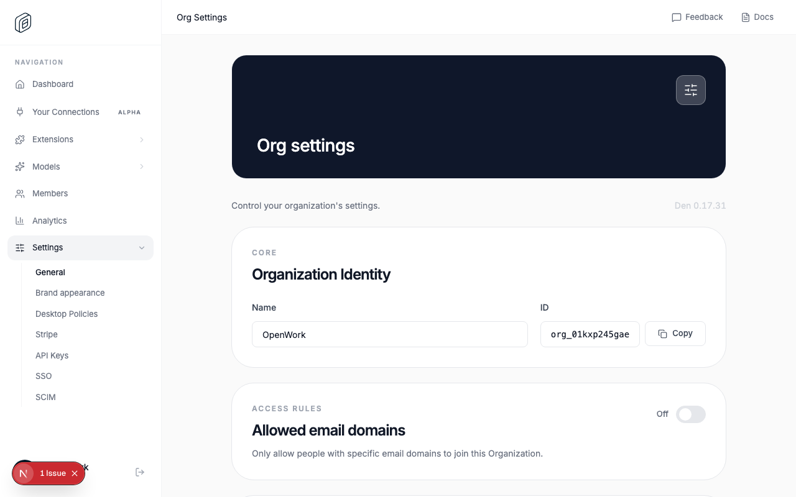

# Den Web runtime version proof

The fraimz flow signs in to Den Web, confirms that Org settings keeps its page
description on the left and the running Den version at the far right in a
discreet light gray, and checks that the value matches the public Den API health
response.



Run locally with Den API, Den Web, the seeded demo workspace, and a CDP browser
available:

```bash
OPENWORK_EVAL_DEN_API_URL=http://127.0.0.1:37305 \
OPENWORK_EVAL_DEN_WEB_URL=http://127.0.0.1:37304 \
OPENWORK_EVAL_DEN_API_VERSION=0.17.31 \
pnpm fraimz --flow den-api-runtime-version --cdp-url http://127.0.0.1:37309
```

See [report.md](./report.md) for the recorded assertions and voice-over
coverage from the passing run.
