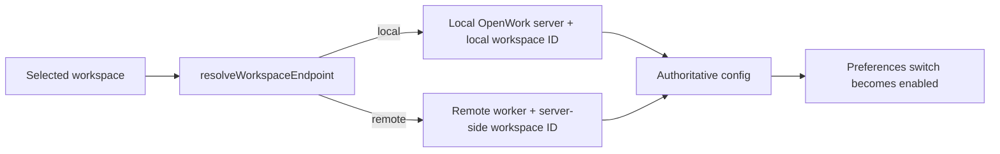

# Remote auto-compaction preference ownership

Auto context compaction is workspace configuration. The server that owns the
selected workspace is therefore the only authoritative place to read or write
`opencode.compaction.auto`.

Before this change, Preferences resolved the selected workspace's runtime ID
but always called the local OpenWork client. For a remote workspace, that mixed
a remote ID with the local server. The result could be a false default in the
UI, a failed update, or a change to unrelated local state. The switch was also
enabled after a failed load, so an unverified default looked authoritative.

## Endpoint-owned configuration

The load and save helpers accept one endpoint target containing both the
client and its workspace ID. Keeping those values together makes it difficult
to accidentally send a remote ID through the local client. Local workspaces
still resolve to the local endpoint, so their behavior is unchanged.

## Loading, switching, and failure behavior

The switch is enabled only when configuration has loaded for the exact
endpoint object currently selected. When the user changes workspaces, the new
endpoint has a different identity and the control immediately returns to its
disabled loading state.

Each load also has a cancellation guard. If an earlier workspace responds
after the user selects another one, the late response is ignored instead of
overwriting the current preference.

If the owning server cannot provide configuration, the switch remains
disabled. OpenWork does not present the default as confirmed and does not fall
back to the local server. A reconnect or endpoint refresh creates a new target
and reloads the authoritative value.

## Security and compatibility

- Remote requests use only the client and credential already associated with
  the selected remote endpoint.
- Local requests continue to use the local OpenWork client and local token.
- No credential is copied, persisted, logged, or sent to a fallback endpoint.
- No Den, server, IPC, database, generated client, or wire contract changes
  are required.
- The implementation is limited to app-side routing, loading state, and
  focused tests for the preference contract.
