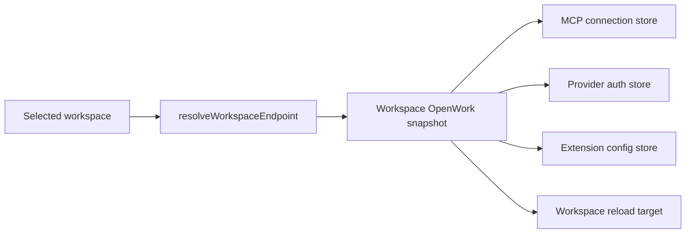

# Remote Settings connection ownership

Settings has several long-lived stores for MCP connections, provider
credentials, imported extensions, and engine reloads. Those stores operate on
workspace-owned state, so they must all agree on the OpenWork server that owns
the selected workspace.

Before this change, Settings created a remote OpenCode client for the selected
workspace but continued passing the local host's OpenWork server store to its
MCP and provider stores. A remote workspace ID could therefore be paired with
the local client. Reads could show local connections, writes could target the
wrong config, and a remote provider reload could restart the local desktop
engine.

## One selected-workspace server projection

`workspaceOpenworkServerSnapshot` projects the endpoint into the narrow server
shape consumed by the stores: client, status, capabilities, base URL, token
presence, and whether the owner is remote. The stores no longer receive the
host-wide local server store for workspace-scoped work.

The endpoint's client and server-side workspace ID are captured together when
a config mutation requests a reload. A later workspace selection cannot move
that pending reload to another server.

## Reload and failure behavior

- Local workspaces may use the existing desktop engine restart fallback when
  their local managed OpenCode engine is unreachable.
- Remote workspaces never invoke that local desktop fallback. A failed remote
  server reload remains a remote failure and can fall back only to the remote
  OpenCode client behavior already owned by the provider store.
- Missing endpoints project as disconnected with no capabilities, client, or
  token, so workspace configuration actions fail closed.
- The host-wide local server store remains available for host diagnostics and
  lifecycle actions; only workspace-owned stores use the endpoint projection.

## Security and compatibility

- A remote worker token stays in its existing endpoint-bound client and is not
  substituted with the local client token.
- No token value is logged or copied into a new persistence layer.
- No Den, server, IPC, database, generated-client, or wire-contract change is
  introduced.
- The current proof is deterministic and internal (`requiresApp: false`). It
  validates endpoint projection, reload ownership, and fallback policy but
  does not claim a live remote-worker screenshot.
