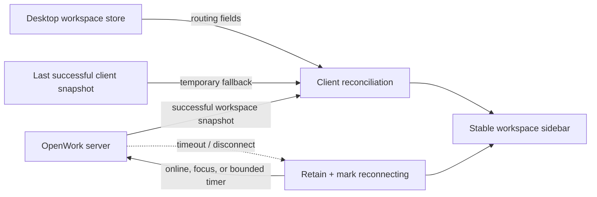

# Remote workspace reconciliation

OpenWork combines workspace records from more than one runtime:

- the desktop workspace store owns local connection details, including remote
  worker routing and credentials;
- the connected OpenWork server provides its current workspace snapshot; and
- the React client keeps the last successfully rendered snapshot while it is
  running.

Before this change, Session and Settings treated a failed server refresh like
an authoritative empty response. They replaced the rendered list with the
desktop-only list, so server-sourced remote workspaces disappeared and then
returned after a later successful refresh.

## Reconciliation model

The client now separates **absence** from **unknown availability**:

| Event | Workspace-list decision |
| --- | --- |
| Successful server response | Reconcile against the live snapshot; confirmed missing entries may be removed. |
| Desktop store refresh | Apply newer desktop-owned routing fields and add newly created desktop workspaces. |
| Timeout, network error, or unavailable server | Retain the last successful snapshot; do not infer deletion. |
| Explicit user removal | Remove immediately from both persistent stores and the retained in-memory snapshot. |
| Connectivity returns | Retry, verify remote workers, and reconcile without duplicate rows or order churn. |

Reconnect work is targeted. A normal successful route refresh reloads the
selected workspace, newly discovered workspaces, and remote workspaces that
were explicitly marked pending by a failed refresh. Healthy cached remote
workspaces are not re-fetched on every unrelated route refresh.

## Why this is safe

- The fallback is in memory only. It does not copy worker tokens or workspace
  paths into a new browser cache.
- Existing desktop storage remains authoritative for desktop-managed remote
  connection details.
- A specific worker error, such as a rejected token, is not overwritten by a
  generic reconnecting state.
- Retry signals are bounded and respect the existing in-flight guard, so a
  slow request is not multiplied by the background timer.
- No Den, OpenWork server, IPC, or database contract changes are required.

## Recovery behavior

Remote rows remain visible with their cached tasks and show
`Remote · Reconnecting…` while the owning endpoint is rechecked. OpenWork
retries when the network returns, when the app regains focus, and every 30
seconds while a refresh is known to have failed. A successful remote task load
clears the reconnecting state.

A completely fresh browser launch still cannot reconstruct a server-only
workspace while every server is unavailable. Desktop-managed remote
workspaces remain recoverable because their existing desktop store is loaded
before server reconciliation.
