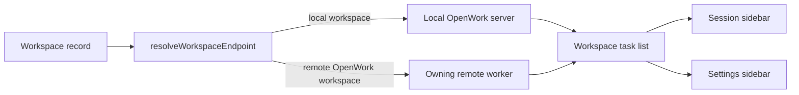

# Settings remote workspace routing

OpenWork shows the workspace and task sidebar on both the main Session route
and Settings. Those routes must agree about which OpenWork server owns each
workspace.

Before this change, Session used `resolveWorkspaceEndpoint`, while Settings
loaded every task list through the local OpenWork server. Settings also skipped
desktop-managed remote workspaces that were absent from the local server's
workspace list. A healthy remote workspace could therefore show tasks in
Session and become empty as soon as the user opened Settings.

## One routing contract

Settings now resolves every merged workspace through the same endpoint helper
as Session and calls `listSessions` with the owning server's workspace ID.

| Workspace kind | Server | Credential | Workspace ID |
| --- | --- | --- | --- |
| Local | Connected local OpenWork server | Local client token | Local workspace ID |
| Remote OpenWork | Saved worker URL | Saved worker token | Explicit server-side ID, or normalized `rem_` ID |

## Shared filtering behavior

The two routes also shared an undocumented filtering rule with separate
implementations. Local server session indexes may contain sessions for several
directories, so local workspaces keep directory filtering. A remote OpenWork
worker already scopes its response to the mounted workspace; applying the
local directory filter there can incorrectly discard valid worker sessions.

That rule now lives in `filterSessionsForRouteWorkspace` and is consumed by
both routes.

## Failure and security behavior

- Missing or unreachable remote endpoints still use the existing remote
  workspace diagnostic and recovery flow.
- A remote token is sent only to the remote endpoint selected from that
  workspace record; it is never substituted with the local server token.
- Local workspaces continue using the local server and local token.
- No tokens are copied into a new cache, and no Den, server, IPC, database, or
  wire contract changes are introduced.
