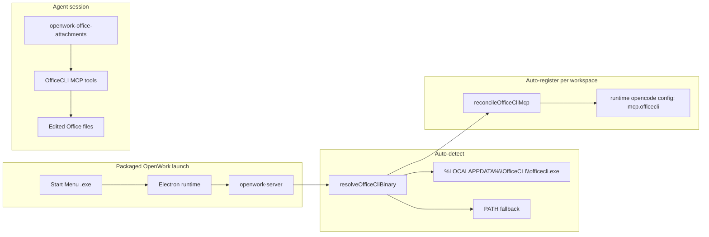

# OfficeCLI auto-integration for packaged Windows OpenWork

**Status:** Approved for implementation planning  
**Date:** 2026-08-22  
**Scope:** Private fork (`Shishykish/openwork-private`) — solo developer, Windows packaged `.exe` only (v1)

## Problem

OpenWork already ingests Office attachments (`.docx`, `.pptx`, `.xlsx`) via the
`openwork-office-attachments` OpenCode plugin: it materializes files into the
workspace inbox and extracts bounded text for the model. It does not create or
edit Office documents.

[OfficeCLI](https://github.com/iOfficeAI/OfficeCLI) is installed on the
developer machine at `%LOCALAPPDATA%\OfficeCLI\officecli.exe` and exposes a
stdio MCP server via `officecli mcp`.

**Goal:** When the user launches the **packaged Windows installer** (Start Menu,
no terminal), OpenWork should **automatically** register OfficeCLI as a local MCP
server — zero manual Settings configuration.

## Constraints

- Solo developer; minimize maintenance and diff size against upstream.
- OfficeCLI is **user-installed**, not bundled in the OpenWork installer.
- v1 is **Windows only**; macOS/Linux detection is out of scope.
- Must not fight user MCP configuration in Settings.
- Packaged GUI apps often inherit a **stripped PATH**; resolution must use a
  **full binary path** in the MCP `command` array, not rely on `officecli` alone.

## Non-goals (v1)

- Bundling OfficeCLI in `prepare-sidecar.mjs`
- Artifact panel HTML preview (`officecli view html`)
- Auto-installing the OfficeCLI agent skill
- Den marketplace / org policy integration
- Replacing the existing OOXML text extractor in `openwork-office-attachments`

## Recommended approach

**Server startup reconcile** (mirrors `reconcileLocalManagedMcpRuntimeEntries`):

1. Detect `officecli.exe` at startup.
2. For each authorized workspace, ensure a managed `mcp.officecli` entry exists.
3. Extend desktop runtime PATH on Windows so bash-side tools can also find the
   binary.

## Architecture



### New components

| Unit | Location | Responsibility |
|------|----------|----------------|
| `resolveOfficeCliBinary()` | `apps/server/src/officecli-mcp.ts` | Find binary; return `null` if missing |
| `reconcileOfficeCliMcp()` | `apps/server/src/officecli-mcp.ts` | Provision/update managed MCP per workspace |
| `reconcileOfficeCliMcpForAllWorkspaces()` | `apps/server/src/officecli-mcp.ts` | Iterate `config.workspaces` |
| PATH enrichment | `apps/desktop/electron/runtime.mjs` | Add `%LOCALAPPDATA%\OfficeCLI` on `win32` |

### Managed MCP entry shape

```json
{
  "type": "local",
  "enabled": true,
  "command": ["C:\\Users\\<user>\\AppData\\Local\\OfficeCLI\\officecli.exe", "mcp"],
  "openworkManaged": true
}
```

`openworkManaged: true` marks entries OpenWork may update (e.g. when the binary
path changes after reinstall). User-created entries without this flag are never
modified.

## Data flow & lifecycle

### When reconcile runs

1. **Server startup** — in `startServer()`, after
   `reconcileLocalManagedMcpRuntimeEntries()`, wrapped in try/catch (warn on
   failure, do not block server start).
2. **Workspace create** — after `POST /workspaces/local` seeds runtime config and
   persists workspace state.

### Binary resolution (`resolveOfficeCliBinary`)

Windows only in v1. Lookup order:

1. `process.env.OPENWORK_OFFICECLI_PATH` if set (escape hatch for testing /
   non-standard installs).
2. `%LOCALAPPDATA%\OfficeCLI\officecli.exe` (default `install.ps1` location).
3. PATH scan for `officecli.exe` (fallback for scoop/npm installs).

Returns absolute path string, or `null` if not found.

### Provision rules (`reconcileOfficeCliMcp`)

Per workspace runtime OpenCode config (`readRuntimeOpencodeConfig` / `addMcp`):

| Existing `mcp.officecli` | Action |
|--------------------------|--------|
| Missing; workspace KV `officecliProvision` is not `removed` | Create managed entry; set KV to `managed` |
| Present with `openworkManaged: true` | Update `command[0]` if binary path changed; preserve `enabled` |
| Present without `openworkManaged` | Do not modify (user-owned config) |
| Workspace KV is `removed` | Do not auto-add (user opted out) |

**User opt-out:** When the user deletes the `officecli` MCP via Settings and the
deleted entry had `openworkManaged: true`, set workspace KV `officecliProvision`
to `removed`. Reconcile will not re-add until the user manually adds it back
(clearing the KV is not required for manual re-add via UI).

**User disable:** If `enabled: false`, reconcile preserves that value.

### Agent workflow (unchanged)

1. User attaches an Office file in chat.
2. `openwork-office-attachments` materializes bytes to
   `.opencode/openwork/inbox/chat-attachments/<hash>.<ext>` and supplies
   `worker_relative_path` in normalized text.
3. Agent invokes OfficeCLI MCP tools against that path (`get`, `set`, `view`,
   `batch`, etc.).
4. User downloads the result from the artifact panel or workspace folder.

### PATH enrichment

In `apps/desktop/electron/runtime.mjs` → `extraPathEntries()`, for `win32`:

```js
process.env.LOCALAPPDATA
  ? path.join(process.env.LOCALAPPDATA, "OfficeCLI")
  : null
```

This helps bash-tool invocations find `officecli` even when the MCP entry already
uses a full path.

## Error handling

| Scenario | Behavior |
|----------|----------|
| OfficeCLI not installed | Skip reconcile; debug-level log; app works normally |
| Binary exists but MCP fails to start | Existing MCP health UI surfaces error; user can disable |
| Non-Windows | No-op in v1 |
| OfficeCLI reinstalled to new path | Managed entry `command[0]` updated on next reconcile |
| Reconcile throws | Log warning; server continues starting |

## Testing

| Test | Type | Assertion |
|------|------|-----------|
| Resolves default Windows install path | Unit | `officecli-mcp.test.ts` |
| Returns null when binary missing | Unit | Graceful skip |
| Adds managed MCP when absent | Unit | Config contains `openworkManaged: true` |
| Does not overwrite user-owned entry | Unit | Entry without flag unchanged |
| Respects `officecliProvision: removed` | Unit | No re-add |
| `extraPathEntries` includes OfficeCLI dir on win32 | Unit | `runtime.test.mjs` |
| Attach docx → MCP tool edits file | Manual | Packaged `openwork-win-x64-*.exe` smoke |

Full Daytona eval is optional for v1; unit tests plus manual packaged-exe smoke
are sufficient for a solo fork.

## Files to change

| File | Change |
|------|--------|
| `apps/server/src/officecli-mcp.ts` | New: resolve + reconcile |
| `apps/server/src/officecli-mcp.test.ts` | New: unit tests |
| `apps/server/src/server.ts` | Hook startup reconcile |
| `apps/server/src/routes/workspaces.ts` | Hook workspace create |
| `apps/server/src/mcp.ts` or MCP delete route | Set `officecliProvision: removed` on managed delete |
| `apps/desktop/electron/runtime.mjs` | PATH enrichment |
| `apps/desktop/electron/runtime.test.mjs` | PATH test |

## Upstream sync note

This is a private-fork feature. Keep changes isolated in the files above to ease
`git merge upstream/dev`. Do not modify `openwork-office-attachments` in v1.
