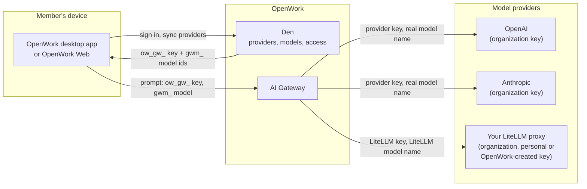
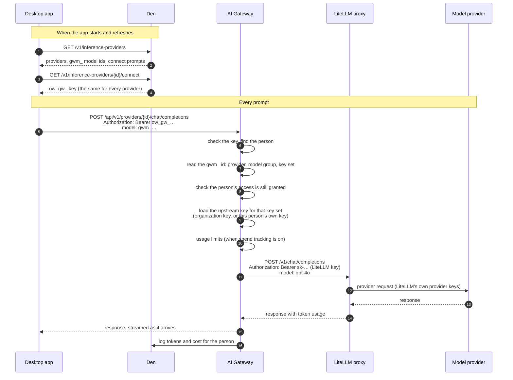
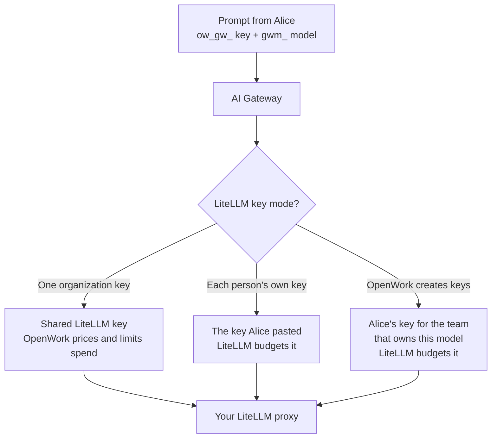

Members never hold provider keys. The desktop app (or OpenWork Web) gets **one AI Gateway key per person**, plus a list of the models that person may use. Every prompt goes to the gateway with that one key. The gateway works out which provider and which upstream key to use, swaps them in, and sends the request on.

## One key in, many keys out

- **AI Gateway key** (`ow_gw_…`): one per person per organization. It proves who is asking. It never leaves OpenWork.
- **Model id** (`gwm_…`): each model the person may use has its own id. It encodes the model, the model group and the key set that grants it, so the gateway knows exactly which access rule applies.
- **Provider keys**: stored encrypted in Den and only read by the gateway. A provider key is either one key shared by the organization, or a key that belongs to one person, such as their own Google sign-in or their LiteLLM key.

## What happens on each prompt

The desktop app sends each provider's requests to that provider's gateway URL, `/api/v1/providers/{id}`, using the provider's normal SDK. Other clients can leave the provider out and call `/api/v1/chat/completions`, `/api/v1/responses` or `/api/v1/messages` with a `gwm_` model id; the gateway finds the provider from the id.

The gateway removes the person's AI Gateway key before forwarding, so a provider, including your LiteLLM proxy, never sees it. It also replaces the `gwm_` id with the provider's real model name, so LiteLLM receives `gpt-4o`, not an OpenWork id.

## Which upstream key the gateway uses

Each model reaches a person through a **key set**. The key set decides which upstream key the gateway loads:

| Key set | Upstream key on each request | Example |
| --- | --- | --- |
| Organization key | The one key the admin saved | OpenAI, Anthropic, LiteLLM "One organization key" |
| Each person's own credential | That person's own key or sign-in, never someone else's | Google sign-in for Vertex, LiteLLM "Each person's own key" |
| Keys OpenWork creates | The LiteLLM key OpenWork created for that person and team | LiteLLM "OpenWork creates keys" |

If a person's own credential is missing, the gateway refuses the request and the app shows a **Connect** prompt for that provider. It never falls back to an organization key.

### LiteLLM in each mode

With **OpenWork creates keys** and one key per team, a person in two LiteLLM teams holds two keys. Each model id points at one team's key set, so a request for a research model uses the research team's key and is billed to that team in LiteLLM.

## Spend tracking

Every request is logged with its token counts. Whether OpenWork also prices it and applies usage limits depends on whose key paid:

- **Organization keys**: priced from the provider's prices (for LiteLLM, the prices synced from your proxy) and checked against your [spend limits](/ai-gateway/overview).
- **A person's own LiteLLM key, or one OpenWork created**: tokens only. LiteLLM's own user, team and key budgets apply, so OpenWork does not block or charge these requests.

See [Use your LiteLLM proxy](/ai-gateway/litellm) to set up each mode.
