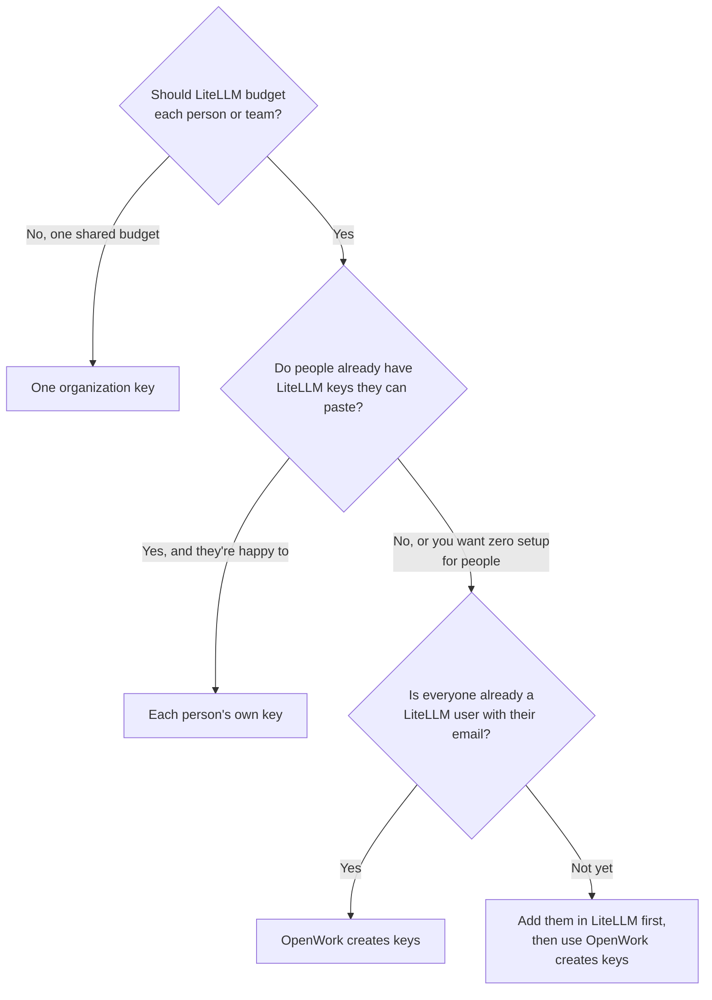
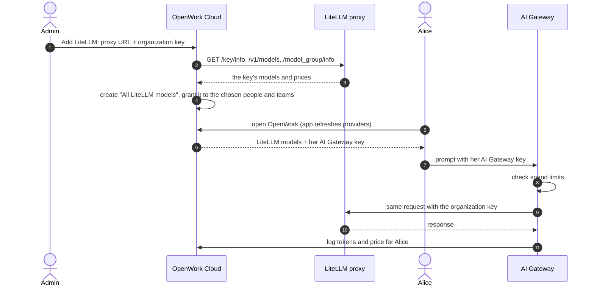
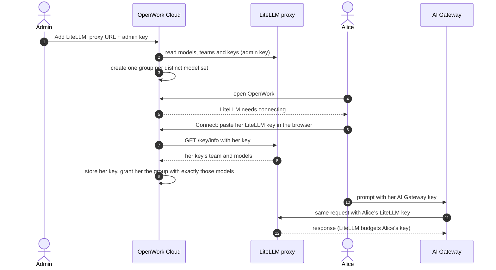
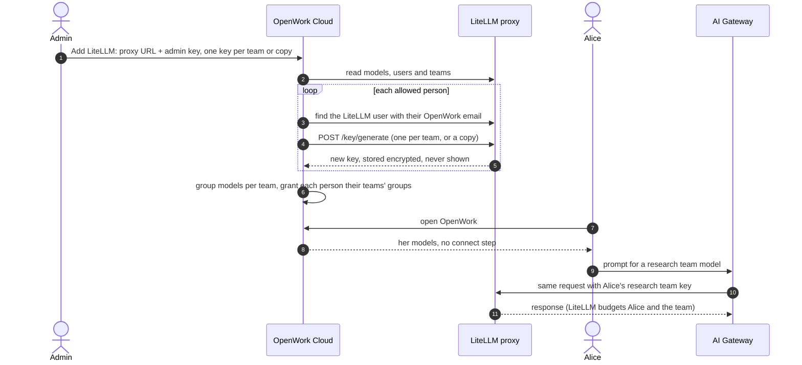
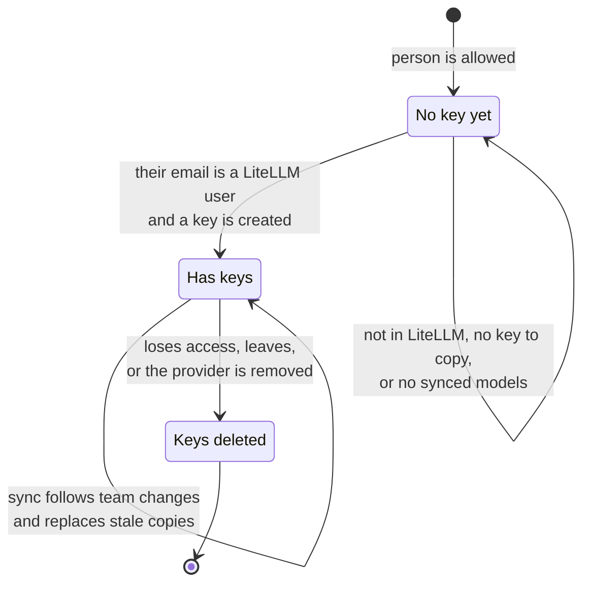

<Note>
**Preview.** LiteLLM is off until a platform administrator turns it on for your organization, so it doesn't appear under **Add a provider** until then. To try it on OpenWork Cloud, contact [the OpenWork team](mailto:team@openworklabs.com). On a self-hosted deployment, a platform admin turns on **AI Gateway: LiteLLM** for the organization in Den `/admin`, or an operator turns it on for the whole install with the Helm value `config.features.litellm`.
</Note>

Connect a LiteLLM proxy you already run to OpenWork AI Gateway. OpenWork reads the proxy's models, creates model groups for them, and routes requests through the gateway to LiteLLM.

## Pick how keys work

| | One organization key | Each person's own key | OpenWork creates keys |
| --- | --- | --- | --- |
| Key you paste | A LiteLLM virtual key that everyone shares | A LiteLLM **admin key**, used only to sync models and teams | A LiteLLM **admin key**, used to sync and to create each person's key |
| Models people get | Every chat model the organization key can use | The models each person's own key can use | Their LiteLLM teams' models, or a copy of their existing key |
| What people do | Nothing | Paste their own LiteLLM key once | Nothing |
| Spend tracking and limits | On. OpenWork prices usage from LiteLLM's model prices and applies your usage limits | Off. LiteLLM's budgets and rate limits apply | Off. LiteLLM's budgets and rate limits apply |

### Which mode fits

Whatever the mode, people's apps hold one AI Gateway key, never a LiteLLM key. See [How a prompt reaches a model](/ai-gateway/how-requests-flow) for the full request path.

## How LiteLLM maps to OpenWork

| LiteLLM | OpenWork |
| --- | --- |
| Model (`model_name`) | Model on the LiteLLM provider |
| Team, or a key's own model list | Model group. People whose keys reach exactly the same models share one group, named after their LiteLLM team when OpenWork knows it |
| Virtual key | The organization key, or one person's own key |
| Budgets and rate limits | Enforced by LiteLLM. With one organization key, OpenWork's usage limits apply too |

Embedding, image and audio models are skipped. Model names, context limits, prices and capabilities come from LiteLLM's `/model_group/info`. OpenWork leaves out facts LiteLLM does not know, such as models missing from its price list.

## Set it up

<Steps>
  <Step title="Add the provider">
    In OpenWork Cloud, go to **AI Gateway → AI Providers → Add a provider → LiteLLM**. Enter your proxy URL, for example `https://litellm.example.com`, with or without `/v1`.
  </Step>
  <Step title="Choose the key mode and paste the key">
    Paste the organization key, or an admin key if each person uses their own key. OpenWork checks the key with your proxy before saving. Keys are write-only and never shown again.
  </Step>
  <Step title="Choose who gets access">
    With one organization key, these people and teams can use the models. With per-person keys, they are the people allowed to connect their own key.
  </Step>
  <Step title="People connect their key (per-person keys only)">
    In the OpenWork app, people choose the LiteLLM provider and select **Connect**. A browser page asks for their LiteLLM key. OpenWork checks it and grants the group that matches the key's models.
  </Step>
</Steps>

## How each mode works

### One organization key

Everyone shares the organization key's models and LiteLLM budget. OpenWork prices each request from LiteLLM's model prices, so per-person reports and OpenWork spend limits work as they do for other providers. In LiteLLM, all usage shows under the one key.

### Each person's own key

The admin key is used only to read LiteLLM. For a key without a team, LiteLLM lists every model on the proxy but only serves the ones its owner may use, so OpenWork checks the owner's own model list and grants just those. Each request uses the person's own key, so LiteLLM's user, team and key budgets apply and LiteLLM's logs show the real person. OpenWork logs tokens but not cost. If LiteLLM later rejects a key, the next sync revokes it and the person sees **Connect** again.

### OpenWork creates keys

People do nothing. Spend lands in LiteLLM on the right person and team, and OpenWork logs tokens but not cost.

## Keys OpenWork creates

LiteLLM stores only a hash of each key, so OpenWork cannot read anyone's existing key. Instead it finds each allowed person's LiteLLM user by their OpenWork email and creates new keys for them.

Choose what each person gets:

- **One per LiteLLM team**: a key for each LiteLLM team they belong to, so each team's models and budget apply, and spend lands on that team. Someone in no team gets one key that follows their own LiteLLM user settings. In OpenWork, their models are grouped by team.
- **Copy their existing key**: a copy of their oldest active key, with the same team, models, model aliases, tags and expiry. Key-level budgets and rate limits are not copied, because a copy would double the allowance. Team and user budgets still apply. For someone with no key to copy, choose **Use their teams** or **Show an error**.

Created keys can only call models: they can't manage LiteLLM, even if the person is a LiteLLM admin. OpenWork never creates LiteLLM users, because it can't know which teams they belong in. People whose email isn't in LiteLLM are listed on the provider page under **No key yet**, and see why when they select **Connect** in the app. Once a LiteLLM admin adds them, the next sync, or **Check again** on that page, creates their keys.

Keys are created when the provider is added, at each sync, and the first time an allowed person opens OpenWork. When someone loses access or leaves the organization, their keys are deleted in LiteLLM at the next sync. Removing the provider deletes every key OpenWork created there. Deleting the whole organization does not touch your LiteLLM proxy.

## Keep models in sync

Select **Sync models** on the provider page after you change models, teams or keys in LiteLLM. A sync:

- refreshes the model list and prices
- with per-person keys, rechecks every connected key, moves people to the group that matches their key, and revokes keys LiteLLM now rejects
- with keys OpenWork creates, creates keys for newly allowed people, follows team changes, replaces copies whose original key changed, and deletes keys of people who lost access
- removes the models of people you no longer allow to connect

If LiteLLM can't be read, OpenWork keeps the last synced models and shows the error on the provider page.

## Troubleshooting

| What you see | Why | What to do |
| --- | --- | --- |
| LiteLLM is missing from **Add a provider**, or a request returns `feature_disabled` | LiteLLM hasn't been turned on for your organization, or was turned off. People keep the models they already have, but adding, syncing and connecting are paused | Ask a platform administrator to turn it on (see the note at the top) |
| "LiteLLM rejected the key" | The key doesn't exist, is blocked, or has expired | Check the key in LiteLLM, or create a new one |
| The key is refused when you add the provider | The proxy URL is wrong, unreachable, or the key is not valid there | Check the URL opens `/v1/models` with that key. For a private proxy, ask the operator to allow its origin |
| "This LiteLLM key can call models but can't manage LiteLLM" | **Each person's own key** and **OpenWork creates keys** need a key that can read users, teams and keys | Use the master key or a proxy admin key |
| A person's key is refused with "no shared models" | Their key reaches none of the synced models | In LiteLLM, give the key at least one chat model, then **Sync models** |
| A person is under **No key yet**: not in LiteLLM | No LiteLLM user has their OpenWork email | Add them in LiteLLM with that email, then **Check again** |
| A person is under **No key yet**: no key to copy | Copy mode with **Show an error**, and they have no active key | Create a key for them in LiteLLM, or switch the fallback to **Use their teams** |
| A person is under **No key yet**: no models | Their teams and user settings allow none of the synced models | Give them a model in LiteLLM, then **Sync models** |
| Models are missing after a LiteLLM change | OpenWork keeps the last synced list | Select **Sync models** |
| The provider shows a sync error | LiteLLM couldn't be read | OpenWork keeps the last models. Fix the proxy, then **Sync models** |

## Requirements and limits

- Your proxy must be reachable from OpenWork over HTTPS on a public host. For a private or self-hosted proxy, the operator must allow its origin with `GATEWAY_EGRESS_ALLOWED_ORIGINS` on both Den and the gateway.
- To change the proxy URL or key mode, add a new LiteLLM provider.
- Signing in through your identity provider (LiteLLM's JWT auth) is not supported. Use LiteLLM virtual keys.
- API: `POST /v1/inference-providers/litellm` (mode `org`, `member` or `issued`), `POST /v1/inference-providers/{id}/litellm/sync`, `PATCH /v1/inference-providers/{id}/litellm` to replace the key or change how keys are created, and `PUT /v1/inference-providers/{id}/litellm/member-key` for a person's own key.
