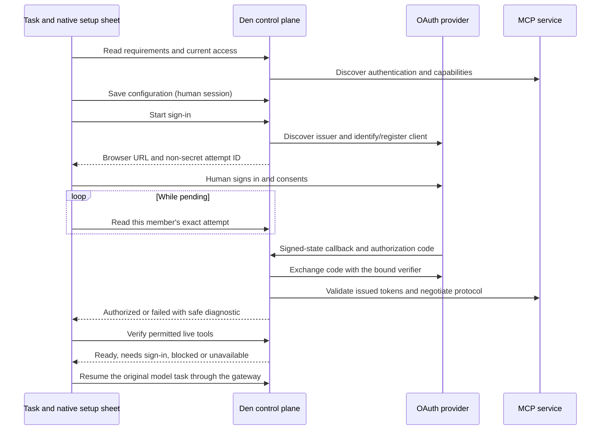

A request such as “connect Resend” should lead to a setup card in the task. An authorized person can configure the service, connect an account, verify usable tools, and continue the original request. Provider consent still opens in the browser; organization settings do not interrupt the native flow.

## Ownership

| Surface | Responsibility |
| --- | --- |
| Agent | Discover the requested service through `search_capabilities` with explicit connect intent. Describe the result without collecting credentials or claiming setup succeeded. |
| Chat catalog | Render the structured result and open the native setup sheet on a human click. Preserve a compact status in the task. |
| Native sheet | Use the signed-in human's Den session. Collect credentials in masked fields; select account mode and people/team access. |
| Den | Resolve existing connections and requirements, enforce permissions, save configuration and credentials, perform OAuth, and verify readiness. |
| Worker | Preserve structured MCP results. After readiness, the existing task send path asks the model to search again and continue. |
| External service | Supply MCP discovery and tools, or native provider OAuth and API endpoints. Authenticate the account and enforce its own permissions. |

## Flow and states

1. The model searches for the requested service. Ordinary discovery remains quiet; explicit setup produces a catalog suggestion. Resend is a curated OAuth preset. A supplied custom MCP URL also gets a suggestion.
2. A click reads `/v1/mcp-connections/setup`. This checks the current organization and member, matches existing accessible connections, and discovers requirements for custom endpoints. It does not register OAuth clients or create credentials.
3. An admin or a custom role with `mcp_connections.manage` sees configuration. Other members can sign in to an existing granted connection; otherwise they see a concrete access explanation.
4. Save uses the existing connection create API. Account mode defaults to a separate account per person for OAuth. Access defaults to the current person, with explicit people, teams, and organization options.
5. API keys stay in authenticated human requests. OAuth opens the provider's authorization URL and waits for the specific sign-in attempt. Google Workspace and Microsoft 365 use their existing native provider routes and callback contracts.
6. `/v1/mcp-connections/:connectionId/readiness` checks the caller's access and live capabilities. External MCPs must return at least one permitted tool. Native providers must have the selected scopes and a valid account. A saved credential alone is insufficient.
7. Readiness refreshes cloud inventory and resumes the same task through the normal submission path. The composer draft and attachments are preserved. An unavailable service stays visibly distinct from a ready connection.

A non-secret attempt key and connection ID allow reopening a saved setup. Recovery by key selects only that attempt. Users can stop waiting and retry sign-in. Managers can replace an API key or repair OAuth app details through the existing edit routes, preserving the connection identity. Organization, principal, or task changes invalidate asynchronous setup work.

The task surface owns the sheet and its readiness state. Streaming or regrouping chat messages can replace a catalog card without discarding an open form or a completed connection check.

## Boundaries

- Credentials and OAuth authorization URLs are excluded from the structured setup result seen by the model. No credential is placed in task continuation text.
- Permission to configure a service does not itself grant access to its tools. Readiness enforces the member's connection grants.
- The first implementation uses the native OpenWork app surface. Other MCP clients retain links to Den setup.
- When an older Den server returns 404 or 405 for native setup, the sheet offers its existing organization setup page. App and server releases can be deployed independently.
- Provider app registration may still require action in the provider's console. The sheet supplies the required callback and fields; it does not claim to create a provider app automatically.
- Local stdio servers continue to use the existing workspace-local setup path.

## Evidence journeys

`connector-catalog.e2e.test.ts` uses a real OpenAI model and separate admin/member desktops. The controlled MCP service records actual authenticated tool calls. Screenshots cover discovery, configuration, pending OAuth, ready/continued task, denied member access, service failure/recovery, and native provider client setup.

`connector-search-intent.test.ts` checks the gateway's quiet discovery behavior, delegated permission and revocation, exact attempt recovery, duplicate prevention, API-key repair, and external/native OAuth app repair at live Den boundaries. Provider fixtures are explicitly synthetic; model decisions and app interactions are real.

## One lifecycle across the app, Den and the provider

| State | Meaning | Next action |
| --- | --- | --- |
| Configuration saved | Endpoint, client settings, requested scopes and grants exist | Sign in; a saved client ID is not evidence of authorization |
| Pending | A particular signed, expiring transaction was started | Finish provider consent; stopping the local wait does not revoke the provider request |
| Token exchange rejected | The provider did not issue usable tokens | Use the diagnostic's action: review client registration, redirect URI, secret or client authentication method |
| MCP rejected issued token | Token exchange completed, but the MCP resource rejected authorization | Provider administrator checks issuer, audience, tenant and granted scopes |
| Authorized | The callback completed validation and persisted the credential | Check live capabilities for the current member |
| Ready | The caller has access and usable tools | Resume the original task |
| Expired or configuration changed | The attempt cannot continue with its original binding | Start a new sign-in |

Den returns `attemptId` from connect/start. Both the native sheet and organization screen poll `/v1/mcp-connections/:connectionId/connect/attempts/:attemptId`. The status belongs only to its initiating member, even for shared connections. The server rechecks current access. It retains at most eight outcomes per member and connection, deletes them with the connection, and derives expiry from the signed transaction's deadline. Retries get distinct IDs; terminal outcomes cannot be overwritten by callback replay.

Attempt records contain a hash of signed state and safe diagnostic fields, never authorization URLs, codes, tokens or verifiers. The browser callback and native sheet expose the same stage, code, action owner and reference. Provider excerpts go through the existing bounded redaction path. Raw customer logs and provider credentials are not forwarded to the model.

Client registration and account authorization also have different recovery rules. The OAuth SDK clears a rejected automatic client registration on `invalid_client`; `invalid_grant` invalidates tokens while retaining client configuration. Den refreshes the connection after a failed attempt so Edit reflects the current registration. Unrelated name, scope or access edits do not resubmit an automatically registered client as a manually configured one.

An HTTP success from the token endpoint is not treated as authorization: the client reports token exchange completion only after parsing and accepting the response. If the server then challenges that token, the result is `MCP_OAUTH_RESOURCE_REJECTED`, including when an SDK tries to restart interactive OAuth during the callback. The signed-state, issuer, PKCE and credential commit checks remain in force.

Older servers without attempt IDs keep the inventory polling path. Legacy native provider aliases retain their existing status flow; native provider connection rows use attempt status. The anonymous failure scenarios establish current behavior, not the root cause of a particular private deployment.
