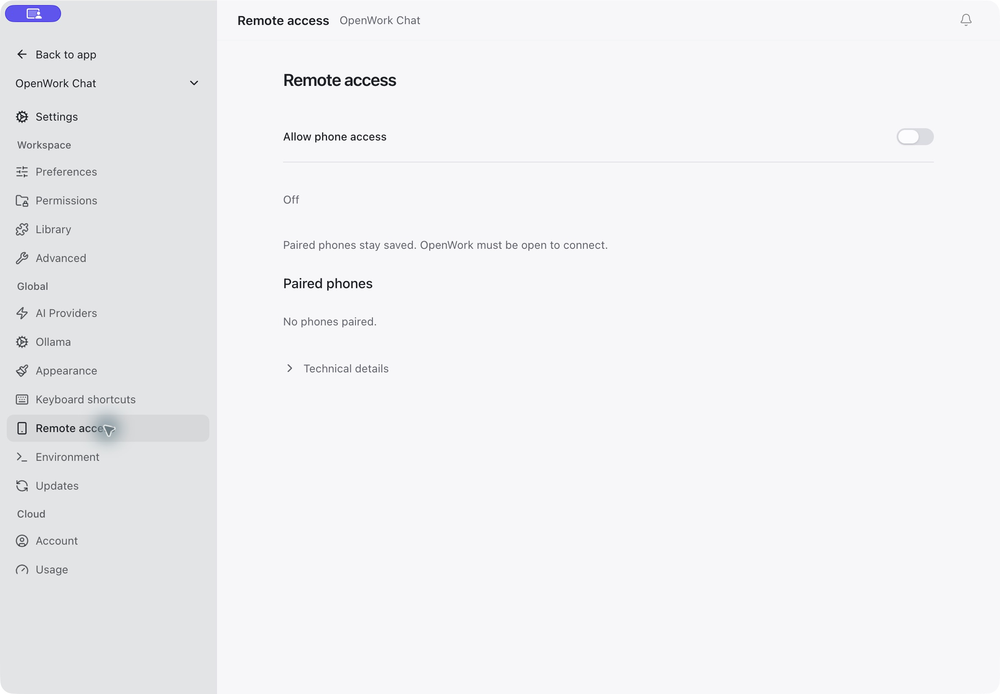
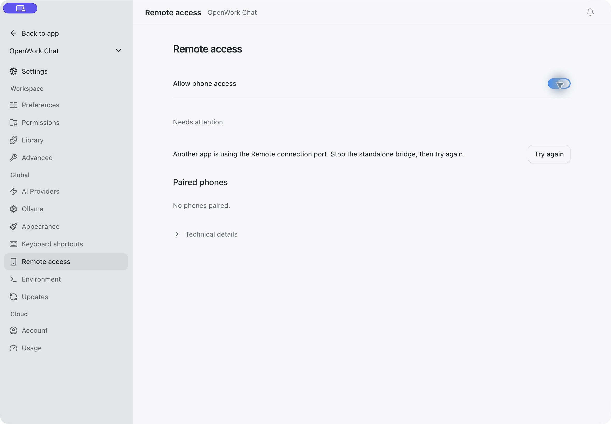

# Remote access qualification

Measured on October 8, 2026. These are source-build development checks, not signed desktop release or App Store qualification. The feature remains off by default.

## Actual hosts

| Check | macOS arm64 | Ubuntu 24.04.5 x86_64 |
| --- | --- | --- |
| Build and launch modified OpenWork/Electron | Passed | Passed |
| Embedded bridge owned by the desktop process | Passed | Passed |
| Private HTTPS send, normalized reply and SSE using a disposable chat | Passed | Passed |
| Standalone-to-desktop handover retains host ID, device hashes, selected/future-project scope and mutation ledger | Passed | Passed |
| Existing session IDs, messages, models, workspace defaults and saved permissions compared before/after | 2 workspaces, 8 chats preserved | 1 workspace, 2 chats preserved |
| Quit closes bridge listener; restart reuses its state | Passed | Passed |
| Admin HTTP port closed in embedded mode | Passed | Passed |
| Existing unrelated Tailscale services retained | Passed | Passed |

Both previously installed desktops were the latest stable release, 0.18.57. Qualification used the modified development desktop with Electron 43.7.7 and its bundled Node runtime, first in isolated profiles, then with backed-up existing profiles. The same-source server identifies itself honestly as `0.0.0-dev`; compatibility is not spoofed as a stable release.

The Linux source build reused the installed release's root-owned Chromium sandbox helper after verifying an identical SHA-256. No `--no-sandbox`, sysctl changes or firewall weakening were used. This does not establish a new self-contained Linux distribution package.

A previously paired iPhone 17 Pro Simulator on iOS 26.5 reconnected to the integrated Linux host without pairing again, read its existing history, created a disposable chat, changed only that chat to `opencode/big-pickle`, and received “Integrated phone check passed.” The original model defaults and existing chats were checked separately. This is Simulator evidence. The physical iPhone had previously connected to the standalone bridge; the integrated physical/cellular acceptance matrix remains unqualified.

The provider used for disposable send checks was `opencode/big-pickle`. OpenWork's free Auto account returned its normal upstream quota denial during a separate test; another catalog entry was unavailable upstream. Provider availability and quotas are not bypassed by this feature. Sending preserves the current session model and performs the same model-selection handshake as the desktop before submitting a prompt.

## Automated checks

- Package tests cover closed schemas, unknown-version rejection, same-source compatibility, engine readiness, credential storage, pairing, project/future-project authorization, lifecycle cleanup, SSE scope/replay/revocation, mutation deduplication, model changes and supported permission decisions.
- Desktop Node tests cover serialized lifecycle, main-frame-only administration, disabled/unavailable feature policy, trusted Den origins, private Tailscale route reuse, public Funnel rejection and concurrent configuration changes.
- React tests cover selected-project approval, unchecked future-project access, visible locked policy, and explicit disconnect confirmation.
- Package, renderer and Electron type checks, IPC coverage and desktop build checks run separately from live-provider checks.
- The standalone public iOS source passes Swift core tests, unsigned Simulator builds and its own pull-request CI.

CI includes the focused package, desktop and UI tests in `ci-tests.yml`. The repeatable commands are in the [package README](../README.md). Feature metadata validation passed locally; the optional Helm rendering step could not run because Helm was not installed.

## Interface evidence

These captures show the actual desktop running in an isolated profile with synthetic project labels. Private account details, hostnames, pairing secrets and real chat transcripts are excluded. The editable onboarding/desktop design remains maintained separately from the public source contribution.

Design references: P1 state, P3 collapsed diagnostics, P4 visible locked policy, P5 existing primitives, P9 explicit project consent, S2 compact settings rows, C6 actionable recovery.

## Release limits

OpenCode v2 chat routing is required; disabled or stopped engines produce a recovery message without modifying engine settings. Only the described macOS and Ubuntu desktop environments have live evidence. Windows, headless hosts, other Linux distributions/architectures, full physical-phone/cellular coverage, signed desktop packages and iOS distribution remain outside this qualification. Deployment administrators must explicitly roll out `remoteAccess` before packaged clients can use it.

## Chat rename follow-up — October 8, 2026

The existing native v2 rename route passed against the modified desktop on macOS arm64 and Ubuntu Linux x64. Each check used an existing disposable qualification chat, changed its title, read it back, restored its original title, and verified unchanged message content and model selection. Both integrated desktops restarted with the updated bridge while retaining host identity, device grants and the mutation ledger; the admin HTTP port remained closed.

The remote-access suite has 48 passing tests on each OS. Rename cases cover authorized updates, receipt replay, invalid titles, missing/out-of-scope sessions, stale titles and lost-response non-retry. The 21 desktop manager/network/policy tests still pass. This is host and Simulator evidence; physical iPhone rename acceptance remains separate.
